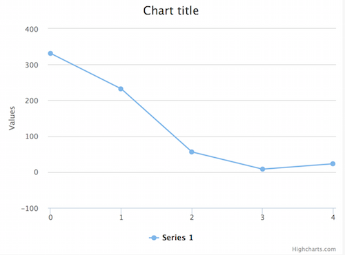
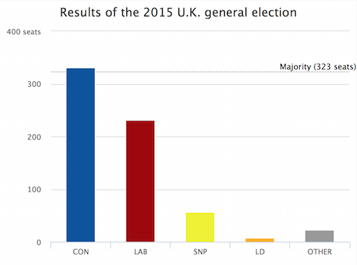
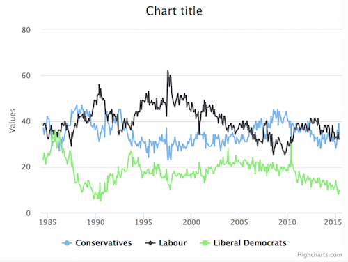

# Highcharts tutorial

Highcharts is a useful JavaScript library for producing [a range of different charts](http://www.highcharts.com/demo) with minimal configuration. In this tutorial, we'll be covering how to create a basic bar and line charts and how to customise them.

Important note: Highcharts is free only for non-commercial use. If you want to use it in your publication, [you'll need to buy a license](http://www.highcharts.com/products/highcharts).

## Your first highchart

Highcharts needs very little HTML, just a `<div>` with a height. Copy and paste this code into your HTML file.

```html
<!DOCTYPE html>
<html>
<head>
  <meta charset="utf-8" />
  <title>Chart</title>
  <script type="text/javascript" src="http://code.jquery.com/jquery-1.9.1.js"></script>
</head>
<body>
  <div id="container" style="height: 400px;"></div>
  <script src="http://code.highcharts.com/highcharts.js"></script>
  <script type="text/javascript">
    // highcharts code goes here
  </script>
</body>
</html>
```

Here's Highcharts at its most basic, with nothing defined apart from data. Paste it into the `<script>` tag above.

```js
$('#container').highcharts({
  series: [{
    data: [331, 232, 56, 8, 23]
  }]
});
```

Here's how it should look:



You've probably noticed that Highcharts has added many questionable elements by default:
- A legend, even when there's only one series
- Chart and Y axis titles
- Annoying Highcharts.com logo
- Styles such as colours and fonts

... plus, because we didn't specify a chart type, it's visualised the data as a line chart.

All of these default settings can be overridden; and they should be, because this is a useless and ugly chart.

Highcharts requires the use of [JavaScript configuration objects](http://javascript.info/tutorial/objects) to  change these default settings. If you've ever used jQuery's [$.ajax](http://jqfundamentals.com/chapter/ajax-deferreds) or [ANOTHER EXAMPLE], you've used configuration objects. Highcharts takes them configuration objects to another level; my objects can span hundreds of lines (even without the data!).

Let's add some more options into our chart's configuration object in order to clarify what this data actually represents.

```js
$('#container').highcharts({
  chart: {
    type: 'column'
  },
  title: {
    text: 'Results of the 2015 U.K. general election'
  },
  xAxis: {
    categories: ['CON', 'LAB', 'SNP', 'LD', 'OTHER']
  },
  series: [{
    data: [331, 232, 56, 8, 23]
  }]
});
```

Right! Much better.

Note how all of these settings are being added to a big JavaScript object. We could define the same thing like so:

```js
var config = {};
config.chart = {};
config.chart.type = 'column';
config.title = {};
config.title.text = 'Results of the 2015 U.K. general election';
config.xAxis = {};
config.xAxis.categories = ['CON', 'LAB', 'SNP', 'LD', 'OTHER']
config.series = [];
config.series[0] = {
  data: [331, 232, 56, 8, 23]
};
$('#container').highcharts(config);
```

However, it's probably simpler to create the config object all in one go.

Anyway, there are still some problems, like the _Highcharts.com_ logo and pointless legend. Let's fix them, and add some colour to boot.

```js
$('#container').highcharts({
  chart: {
    type: 'column'
  },
  credits: {
    enabled: false // removes Highcharts.com in bottom
  },
  title: {
    text: 'Results of the 2015 U.K. general election'
  },
  xAxis: {
    categories: ['CON', 'LAB', 'SNP', 'LD', 'OTHER']
  },
  yAxis: {
    title: null // disables unnecessary title on y axis
  },
  legend: {
    enabled: false // disables legend
  },
  colors: ['#03529E', '#9E0400', '#EFF309', '#FDB009', '#999'],
  plotOptions: {
    series: {
      colorByPoint: true // allows each bar to be coloured differently
    }
  },
  series: [{
    data: [331, 232, 56, 8, 23]
  }]
});
```

How do I know which options to use, and how? The [Highcharts API reference](http://api.highcharts.com/highcharts) contains all potential settings and how to use them. Don't worry about memorising these; just make sure that the page is your first stop when configuring a chart.

Our y axis still doesn't have any unit labels, so who knows what these polls are measured in? Seats? Percentages? Cats? There are multiple ways to modify axis labels, but my favourite is to use an anonymous function with the `formatter` property. This allows us to add 'seats' to just the top label.

```js
$('#container').highcharts({
  // ...
  yAxis: {
    title: null,
    labels: {
      formatter: function(){            // this function is run once for each label
        if (this.isLast){
          return this.value+' seats';
        }
        return this.value;
      }
    }
  },
  // ...
});
```

The function fed into `formatter` contains a special variable called `this`, which contains the label's `value` (0, 10, 20, etc) and whether it `isFirst` or `isLast`. You can find out more in [the Highcharts API reference](http://api.highcharts.com/highcharts#yAxis.labels.formatter).

Finally, let's add a 'plot line' - an arbitrary line for marking limits, etc.

```js
$('#container').highcharts({
  // ...
  yAxis: {
    // ...
    plotLines: [{
      value: 323,                       // position on y axis
      color: '#aaa',                    // \
      dashStyle : 'shortdash',          //  styling
      width: 1,                         // /
      label : {
        text : 'Majority (323 seats)',  // text to go on line
        align: 'right'                  // text positioning
      }
    }]
  },
  // ...
});
```

Here's how our final chart should look. If yours doesn't look like this, [check out the complete code here](examples/chart1.html).



## Working with dates

Wrangling data into a Highcharts-compatible format is often half the battle, especially when it comes to time series data. However, that would make for a very dull tutorial. To save time, I've downloaded and converted a collection of [Guardian opinion polls](http://www.theguardian.com/news/datablog/2009/oct/21/icm-poll-data-labour-conservatives#data) for you to use. I basically just downloaded it from that Google Drive link, cleaned up the CSV file and ran it through [csvtojson.com](http://csvtojson.com).

Let's create a new HTML file and enter the small amount of HTML needed:

```html
<!DOCTYPE html>
<html>
<head>
  <meta charset="utf-8" />
  <title>Chart two</title>
  <script type="text/javascript" src="http://code.jquery.com/jquery-1.9.1.js"></script>
</head>
<body>
  <div id="container" style="height: 400px;"></div>
  <script src="http://code.highcharts.com/highcharts.js"></script>
  <script type="text/javascript">
    // highcharts code goes here
  </script>
</body>
</html>
```

Next, we need to import the data using AJAX. [The JSON file can be found here](data/poll-data.json). Make sure it's in the same folder as your HTML file.

```js
$.getJSON('poll-data.json', function(data){
  console.log(data);
  // we will do stuff with imported data here...
});

```

Once the data is imported, we must shape it into a format that Highcharts can understand. Each line is a 'series', with a `name` and `data`. Inside the `data` array are pairs of dates and the actual y-axis value.

The most reliable way to enter dates in Highcharts is to convert everything to a [Unix timestamp](http://en.wikipedia.org/wiki/Unix_time) using JavaScript's native `Date.UTC()` function. Feed in `year, month, day` as numbers and it will produce a Unix timestamp. (Note: With Date.UTC, months are zero-indexed. That means that January is `0`, May is `4` and December is `11`. Confusing, I know.)

```js
$.getJSON('poll-data.json', function(data){

  // create three empty series to add our data into
  var highchartsFormat = [
    {
      name: "Conservatives",
      data: []
    },
    {
      name: "Labour",
      data: []
    },
    {
      name: "Liberal Democrats",
      data: []
    }
  ];
  
  // loop through each line of the spreadsheet...
  $.each(data, function(i,  row){
    // .. create a Unix timestamp for each row ... 
    var dateArr = row.date.split('-');
    var timestamp = Date.UTC( +dateArr[2], +dateArr[1]-1, +dateArr[0] );
    // ... and add to the Highcharts-formatted data object
    highchartsFormat[0].data.push([ timestamp, row["CON"] ]);
    highchartsFormat[1].data.push([ timestamp, row["LAB"] ]);
    highchartsFormat[2].data.push([ timestamp, row["LIB DEM"] ]);
  });

  // then create the chart
  $('#container').highcharts({
    series: highchartsFormat,
    xAxis: {
      type: 'datetime'    // required, or the x axis is rendered as numbers
    }
  });

});
```

You should see something a bit like this:



A damn ugly chart, but at least the data is in there. Let's clean things up.

```js
// ...

  $('#container').highcharts({
    series: highchartsFormat,
    xAxis: {
      type: 'datetime'    // required, or the x axis is rendered as numbers
    },
    credits: {
      enabled: false    // removes Highcharts.com in bottom
    },
    title: {
      text: 'Guardian/ICM poll results over time'
    },
    yAxis: {
      title: null, // disables unnecessary title on y axis
      labels: {
        formatter: function(){            // this function is run once for each label
          if (this.isLast){
            return this.value+'%';        // add % sign to the top y axis label
          }
          return this.value;
        }
      }
    },
    colors: ['#03529E', '#9E0400', '#FDB009']     // set party colours
  });
// ...
```

Looks good to me. The [complete code for this example is here](examples/chart2.html) if you need it.

## Challenge round

Enough from me -- it's your turn to write some code. Try making these changes to our line chart using the [Highcharts API documentation](http://api.highcharts.com/highcharts) for reference. If you get stuck, answers are the bottom of this page.

1. **Change the chart's colours.** The ones I picked are very dark. How about some nice bright colours instead?
2. **Use a shared tooltip for all three lines.** It would be nice to have all three figures in the box that appears when you hover your mouse.
3. **Shade the time period when New Labour were in power.** Two hints: you'll need to use [plotBands](http://api.highcharts.com/highcharts#yAxis.plotBands) to achieve this, and the dates are *2 May 1997* and *11 May 2010*.

## Further reading

- [Highcharts general documentation](http://www.highcharts.com/docs) - helpful for beginners, but not comprehensive
- [Highcharts API documentation](http://api.highcharts.com/highcharts) - the source of all knowledge!
- [Highcharts examples](http://www.highcharts.com/demo) - get a taste of what's possible.
- [What Greece Owes When]() - an interactive I made. The chart at the top is built with Highcharts.

## Challenge round answers

1. To change the chart's colours, just replace the hex codes in this line:

```js
colors: ['#03529E', '#9E0400', '#FDB009']
```

You can use any CSS-compatible colour, like `rgb(178, 55, 233)` or `hsl(132, 94%, 39%)`. [More info on colours here](http://api.highcharts.com/highcharts#colors).

2. A "shared tooltip" is easy to configure. Just add this to your configuration object. Be careful with commas - you may need to add one before and/or after, depending on where you place it in your code.

```js
tooltip: {
  shared: true
}
```

[More info on shared tooltips here](http://api.highcharts.com/highcharts#tooltip.shared).

3. Don't worry, this one is difficult. I had to rely on the API reference to solve my own challenge! We need to add a `plotBand` to the `xAxis` like so:

```js
    // ...
    xAxis: {
      type: 'datetime',
      plotBands: [{
        from: Date.UTC(1997, 4, 2),
        to: Date.UTC(2010, 4, 11),
        color: '#eee'
      }],
    },
    // ...
```

Note that we're using `Date.UTC` again to generate Unix timestamps. Since months are zero-indexed, May is `4`. [More info on plotBands here](http://api.highcharts.com/highcharts#yAxis.plotBands).


